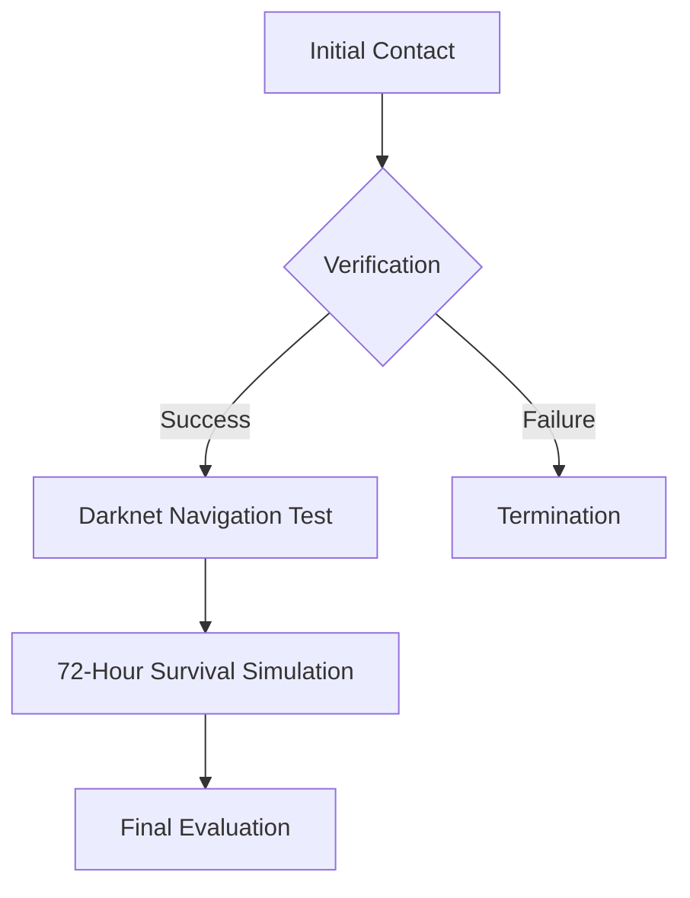

<div align="center">
  
<pre style="font-family: 'Courier New', Courier, monospace; font-size: 18px; line-height: 1.4;">
 _______  __    _  _______  _______  _______  __   __  _______  __   __   _______  __    _  _______  _______ 
|       ||  |  | ||       ||       ||       ||  | |  ||       ||  | |  | |       ||  |  | ||       ||       |
|    ___||   |_| ||   _   ||  _____||_     _||  |_|  ||   _   ||  |_|  | |    ___||   |_| ||  _____||    ___|
|   |___ |       ||  | |  || |_____   |   |  |       ||  | |  ||       | |   |___ |       || |_____ |   |___ 
|    ___||  _    ||  |_|  ||_____  |  |   |  |       ||  |_|  ||       | |    ___||  _    ||_____  ||    ___|
|   |___ | | |   ||       | _____| |  |   |  |   _   ||       ||   _   | |   |___ | | |   | _____| ||   |___ 
|_______||_|  |__||_______||_______|  |___|  |__| |__||_______||__| |__| |_______||_|  |__||_______||_______|
</pre>

<p><em>"Where shadows speak in encrypted whispers, we are the silent guardians of the digital frontier."</em></p>
<p>— Director of Operations, SharpNova</p>

</div>

> _"Where shadows speak in encrypted whispers, we are the silent guardians of the digital frontier."_  
> — Director of Operations, SharpNova

---

### 🛰️ STRATEGIC MISSION DOSSIER (CLASSIFIED LEVEL-5)

The **SharpNova Cyber Warfare Division** represents the pinnacle of offensive and defensive cybersecurity operations. Our organization operates across three parallel dimensions:

1. **Surface Layer**: Public-facing cybersecurity consultancy  
2. **Mid-Layer**: Covert intelligence gathering network  
3. **Deep Layer**: Advanced cyber warfare research unit  

#### CORE OPERATIONAL MATRIX:

| Division         | Operational Scope            | Active Projects               | Clearance Required |
|------------------|-------------------------------|--------------------------------|---------------------|
| **NovaCore**     | Cryptographic Research        | Quantum-Resistant Algorithms   | Level-5             |
| **ShadowSentry** | Threat Intelligence           | APT Countermeasures            | Level-4             |
| **PhantomCell**  | Offensive Security            | Zero-Day Development           | Level-6             |
| **EchoProtocol** | Counter-Surveillance          | Cognitive Security             | Level-3             |

---

### 🕵️ OPERATIVE RECRUITMENT PIPELINE (v4.2)

#### PHASE 0: PRE-SCREENING (Automated Assessment)

```python
class CandidateScreening:
    def __init__(self):
        self.thresholds = {
            'technical': 0.85,
            'psychological': 0.78,
            'ideological': 0.92
        }

    def evaluate(self, candidate_data):
        score = self._calculate_score(candidate_data)
        avg = sum(self.thresholds.values()) / 3
        if score >= avg:
            return self._initiate_contact_protocol()
        return self._disengage_sequence()

    def _calculate_score(self, data):
        # Implementation omitted for security
        pass
````

#### PHASE 1: COGNITIVE BATTERY TESTING

* **Turing-2.0 Assessment**: Modified psychometric test
* **Cryptographic Aptitude**: Real-time problem solving under surveillance
* **Behavioral Analysis**: Micro-expression tracking via webcam

#### PHASE 2: FIELD SIMULATION



---

### 🔐 SECURE ACCESS PROTOCOLS

#### Authentication Matrix:

1. **Primary Layer**: SHA-3-512 Hashed Credentials
2. **Secondary Layer**: Biometric Verification (Retina + Keystroke Dynamics)
3. **Tertiary Layer**: Behavioral Pattern Recognition

#### Communication Channels:

| Platform     | Encryption Protocol | Usage Case               | Self-Destruct Timer |
| ------------ | ------------------- | ------------------------ | ------------------- |
| **Telegram** | MTProto 2.0         | Initial Contact          | 24h                 |
| **Signal**   | Signal Protocol     | Sensitive Communications | 1h                  |
| **Onion**    | AES-256 + Tor       | Critical Operations      | Immediate           |

---

### 🧮 TECHNICAL INFRASTRUCTURE OVERVIEW

#### Core Systems Architecture:

```bash
# System Topology (Simplified)
NovaNet
├── FrontendNodes (Public-facing)
├── SentinelClusters (Threat Detection)
├── PhantomServers (Offensive Operations)
└── VaultZero (Cryptographic Storage)
```

#### Cryptographic Standards:

* **Data-at-Rest**: XChaCha20-Poly1305
* **Data-in-Transit**: Hybrid PQ-Crypto (Kyber + X25519)
* **Authentication**: WebAuthn with FIDO2 Compliance

---

### ⚠️ SECURITY PROTOCOLS AND COUNTERMEASURES

#### Active Defense Mechanisms:

1. **Honeypot Network**: 47 decoy systems across 12 jurisdictions
2. **Cognitive Firewall**: AI-driven behavioral analysis
3. **Quantum Erasure**: Automatic data purging upon breach detection

#### Threat Response Timeline:

| Event             | Response Time | Protocol Activated |
| ----------------- | ------------- | ------------------ |
| Reconnaissance    | <15s          | PhantomDagger      |
| Intrusion Attempt | <3s           | SentinelLock       |
| Data Exfiltration | Instant       | ZeroDayScorch      |

---

### 📡 OPERATIONAL SECURITY GUIDELINES

#### Mandatory OPSEC Procedures:

1. **Communication**

   * Use cryptographic idioms exclusively
   * No operational details on unsecured channels

2. **Data Handling**

   * Triple-wipe all temporary files
   * Maintain physical separation between environments

3. **Identity Management**

   * Rotate digital fingerprints every 72 hours
   * Operate through at least 3 distinct personas

---

### 🚨 EMERGENCY PROTOCOLS (RED ALERT CONDITIONS)

#### Contingency Procedures:

1. **Operation Dark Horizon**: Full network lockdown
2. **Protocol Silent Shadow**: Disinformation campaign
3. **Final Option Phoenix**: Infrastructure self-destruction

```python
def activate_emergency_protocol(threat_level):
    if threat_level >= 9:
        initiate_phoenix_protocol()
    elif threat_level >= 7:
        deploy_countermeasures(tier=3)
    else:
        enhanced_monitoring_mode()
```

---

### 🔗 OFFICIAL CHANNELS (VERIFIED ACCESS ONLY)

| Platform     | Access Link                                          | Verification Required |
| ------------ | ---------------------------------------------------- | --------------------- |
| **Telegram** | [t.me/sharpnovateam](https://t.me/sharpnovateam)     | Yes                   |
| **GitHub**   | [github.com/sharpnova](https://github.com/sharpnova) | Yes                   |
| **Darknet**  | Provided upon clearance                              | Yes                   |

---

### 🔮 FINAL WARNING AND DISCLAIMER

This document contains **CLASSIFIED LEVEL-5** information protected under the International Cybersecurity Act (2024). Any unauthorized access, reproduction, or distribution will result in immediate legal action and activation of counter-intelligence protocols.

**SharpNova Cyber Warfare Division**
**End of Transmission**